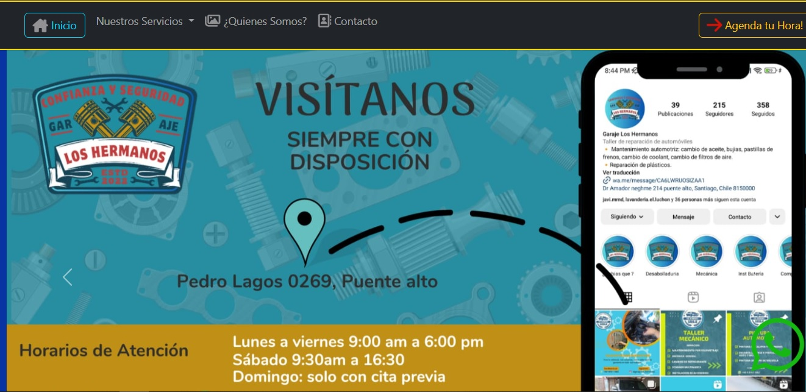
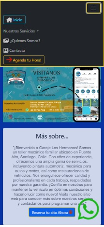

# Taller Mecánico App - tallermk-2.0-DjangoAndMysSql

¡Bienvenido al repositorio de la aplicación Taller Mecánico versión 2.0! Esta aplicación web, desarrollada con Django y MySQL, permite gestionar y mostrar información sobre un taller mecánico, así como los trabajos realizados por los mecánicos.

## Funcionalidades

- **Página de Inicio:**
  - Información del taller.
  - Carrusel con detalles de trabajos realizados para promocionar los servicios.
  - Menú de navegación (barnav) con opciones como "¿Quiénes somos?", "Enviar Currículum", "Contacto" y "Reservas".
  - Formulario de Contacto.

- **¿Quiénes Somos?:**
  - Listado de mecánicos registrados.
  - Detalles de cada mecánico con imagen.
  

- **Formulario de Contacto:**
  - Formulario de contacto para clientes (reclamos, sugerencias).

- **Reservas:**
  - Sistema de reservas para los clientes con validación de horario.
  - Horario: Lunes a Viernes: 9am hasta 6pm; Sábados: 9.30am hasta 3pm (hora de STGO, CL).
  -Envio de Email de confirmación para administrador y cliente.

- **Accesibilidad:**
  - Implementación del sistema ARIA para personas con discapacidad visual.
  - Responsividad, Seguridad y escalabilidad.

- **Diseño:**
  - Diseñado por Williams Diaz.
  - En constante mejora.

## Uso
- AppWeb en producción: https://www.garajeloshermanos.cl

## Contribuciones

¡Las contribuciones son bienvenidas! Si tienes sugerencias de mejoras o encontraste algún problema, por favor crea un issue.

## Autor

- Williams Diaz

## ScreenShot
  -  Version de Escritorio : 

  -  Version responsive : 

*Este proyecto está en constante desarrollo y mejora.*

# Tallermk-2.0-DjangoAndMysSql
Actualmente se encuentra en producción
Puedes verlo en - https://www.garajeloshermanos.cl
